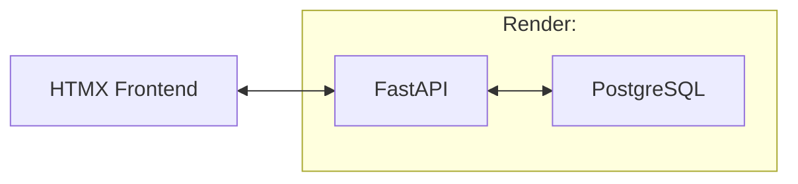

# stock-backtesting-tool

## Purpose

Created this tool to help backtest trading strategies while providing a frontend to be able to view backtesting outcomes.

## Ideas

- List out all of the strategies that you have currently running via an endpoint.
- Run a strategy

## Architecture

