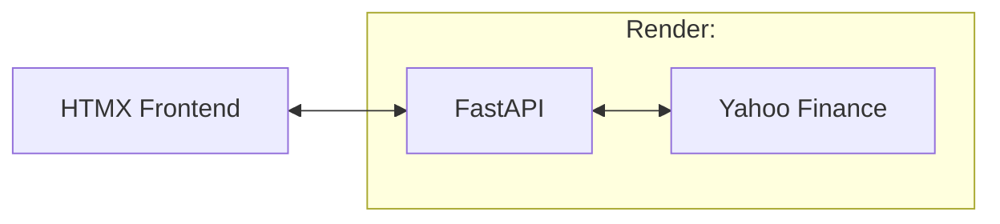

# stock-backtesting-tool

## Purpose

Created this tool to help backtest trading strategies while providing a frontend to be able to view backtesting outcomes.

## Technologies/Libraries

- Python3
- FastAPI
- Ruff (code linting and formatting)
- Pandas (data manipulation)
- Poetry (dependency management)
- HTMX (frontend library)
- Docker

## Code Structure

Within the `app` folder, a variation of the clean architecture was applied in order to have a separation of concerns between various files.

- `clients`: any kind of code that employs fetching data from a third-party data source would be (e.g., an API client that utilizes HTTP).
- `models`: domain object models that are used as a common language between different layers of the application.
- `services`: classes that might do some kind of data aggregation or data manipulation that might interact with different data sources.
- `strategies`: the stock trading execution strategies that determine when to buy and sell a stock.
- `templates`: the UI layer that is rendered in the FastAPI route.
- `repositories` (future work): classes that handle interacting with a data store of some kind.
- `utils`: code that handles generic general functions that could be used across different classes in the `services` folder.

## Setup

This application uses `.githooks` to streamline development workflow using a library called [`pre-commit`](https://pre-commit.com/). Follow the instructions to install `pre-commit` itself.

```bash
pip install pre-commit
```

Once `pre-commit` is installed as a global dependency, run the following to install the `.githooks`:

```bash
pre-commit install
```

## Ideas

- List out all of the strategies that you have currently running via an endpoint.
- Run a strategy
- Store data in a ClickHouse
  - ClickHouse, as a column-oriented OLAP DB, will allow for faster querying on larger datasets.

## TODO List

- [ ] Refactor file generation code into different classes (i.e., )
- [X] Dockerize application
- [ ] Add command line argument parsing to `app/calculate.py` CLI script
- [ ] Create Cron Job to Pull Down Stock Market Data
- [ ] Add Clickhouse to Store Stock Market Data
  - [ ] Store Hourly Stock Market Data
  - [ ] Store Stock Earning Dates

## Architecture

**NOTE: theoretical setup**


