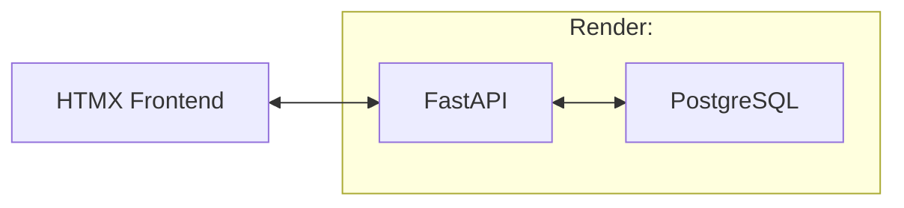

# stock-backtesting-tool

## Purpose

Created this tool to help backtest trading strategies while providing a frontend to be able to view backtesting outcomes.

## Architecture

```mermaid

flowchart LR
    frontend[HTMX Frontend]<-->FastAPI
    subgraph Render:
        direction LR
        FastAPI<-->PostgreSQL
    end
```
